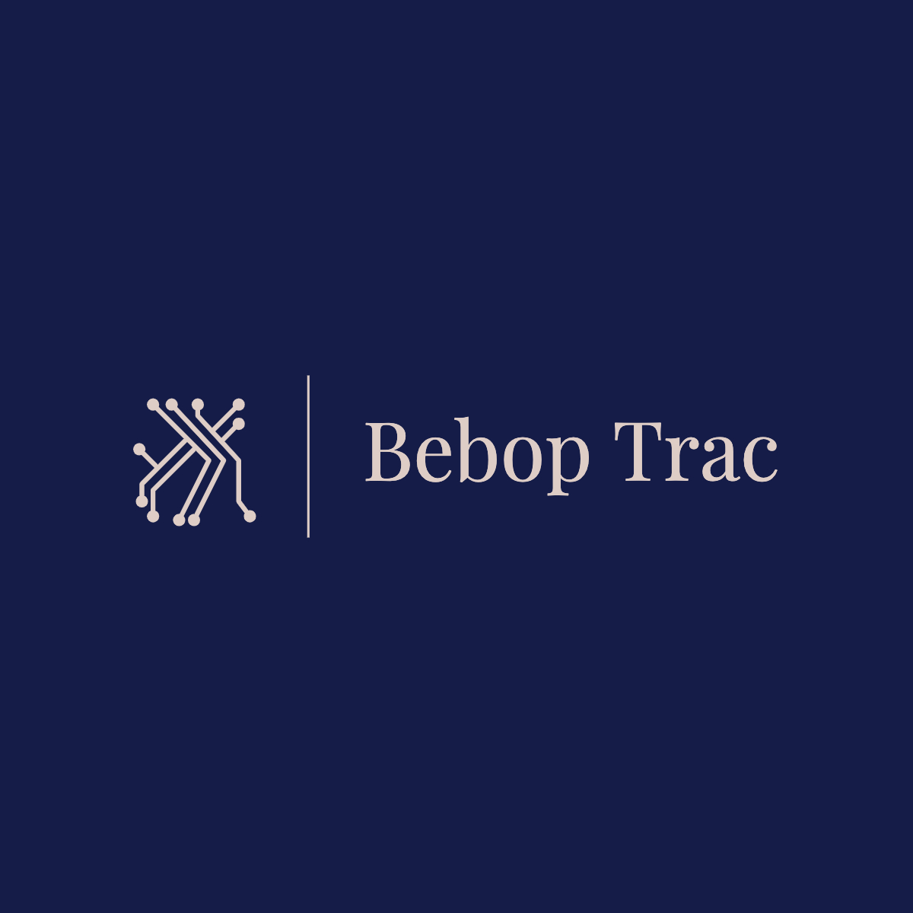

<h2>
BebopTrac
</h2>

<h1 align="center">
    
</h1>

<br>

## 🧪 Tecnologias

Esse projeto foi desenvolvido com as seguintes tecnologias:

- [React](https://reactjs.org)
- [TypeScript](https://www.typescriptlang.org/)
- [HighCharts](https://www.highcharts.com)
- [Ant Design](https://ant.design)

## 🚀 Como executar

Clone o projeto e acesse a pasta do mesmo.

Para iniciá-lo, siga os passos abaixo:

```bash
# Instalar as dependências
$ yarn
# Criar arquivo .env.local na raiz do projeto
# Adicionar as váriaveis de ambiente no novo arquivo
REACT_APP_API_URL=https://my-json-server.typicode.com/tractian/fake-api
# Iniciar o projeto
$ yarn start
```

O mesmo estará disponível no seu browser pelo endereço http://localhost:3000

## 💻 Projeto

BebopTrac é um painel onde você poderá visualizar, e gerenciar seus Ativos, Empresas, Unidades e Usuários.

Aqui abaixo estão alguns prints das telas da aplicação:

> ### Home
> 

> ### Ativos
> 
>
> 


> ### Empresas
> 
> 
> 

> ### Unidades
> 
>
> 

> ### Usuários
> 
>
> 

O restante das funcionalidades é bastante intuitivas.

## 🔖 Layout

O Layout foi criado por mim no decorrer do desenvolvimento do projeto, não sou nenhum especialista em UX UI, mas tentei entregar o meu melhor 🤯
